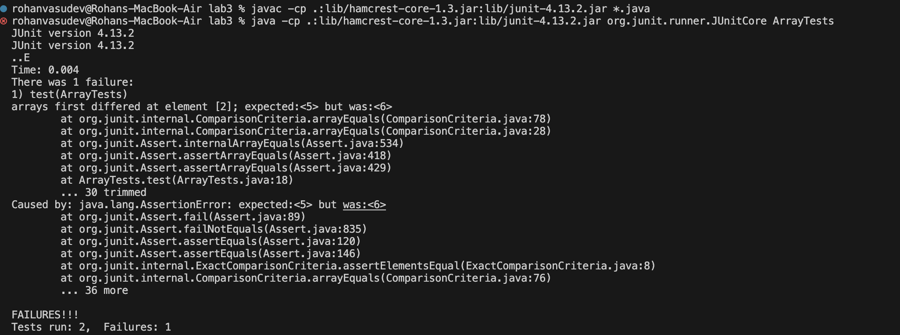
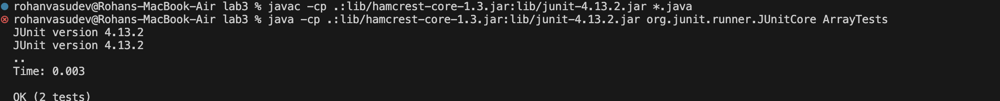

# Lab Report 4

## Part 1

### A failure-inducing input for the buggy program, as a JUnit test and any associated code
```ruby
@Test
public void test(){
  int[] input2={3,5,6,5};
  ArrayExamples.reverseInPlace(input2);
  assertArrayEquals(new int[]{5,6,5,3}, input2);
  
  }

```

### An input that doesn’t induce a failure, as a JUnit test and any associated code 

```ruby
@Test
public void testReverseInPlace() {
    int[] input1 = { 3 };
    ArrayExamples.reverseInPlace(input1);
    assertArrayEquals(new int[]{ 3 }, input1);
	}
```

### The symptom, as the output of running the tests 



### The bug, as the before-and-after code change required to fix it 
Before:
```ruby
static void reverseInPlace(int[] arr) {
    for(int i = 0; i < arr.length; i += 1) {
      arr[i] = arr[arr.length - i - 1];
    }
  }
```

After:
```ruby
  static void reverseInPlace(int[] arr){
  for (int i = 0; i < arr.length / 2; i++) {
        
        int temp = arr[i];
        arr[i] = arr[arr.length - i - 1];
        arr[arr.length - i - 1] = temp;
    }
}
```

Previously, the first element was being changed to the last element and the first element wasn't stored. Thus, when the for loop tries to change the last element to the first element. It is just changing it to the newly stored first element, which is the last element. This problem was there for the entirety of the second half of the array as they were just being changed to themselves. Hence, there was the bug. 

For example, using the example I had with the array {3,5,6,5}.
In the first iteration of the for loop, the first element is given the value of the last element. Thus, the array becomes {5,5,6,5}
Similarly, in the second iteration, the array becomes {5,6,6,5}. The second element is given the value of the the third element
In the third iteration, the array becomes {5,6,6,5}. The third element is given the value fo the new second element(6). Thus, the array stays the same. At this point, the array should become {5,6,5,5} but the old second value isnt stored so the thrid element is instead assigned the new value fo the second element.
Lastly, in the next iteration, the array becomes {5,6,6,5} as the last element is given the new value of the first element instead of becoming {5,6,5,3}. Thus, you can see the bug that appears in reversing the second half of the array as it is just reassigned the same value. 

The new code is changing the first element to the last element and storing the previous value of the first element and then setting that to the value of the last element in the same iteration of the for loop.This pattern is being repeated for all the other elements. Thus, the values are actually being swapped and reversed as the first element is being swapped with the last element. This is the same for the second last element and the second element and so on. Additonally, the for loop only runs for half of the length of the array as two element values are being changed in each iteration.

Again, using the same array as an example: {3,5,6,5}.
In the first iteration, the first and last elements are swapped. Thus, the array becomes {5,5,6,3}
In the second and last iteration, the second and third elements are swapped. Thus, the array becomes {5,6,5,3}, which is the correct solution. 
Therefore, the bug is fixed.

### Proof of symptom being fixed



## Part 2

Chosen command: grep 

I used the man grep command and ChatGPT to find and understadn these different commands.

### grep -r "example string" <path> with directory as argument 
```ruby
grep -r "Portland" ./technical

```

```ruby
rohanvasudev@Rohans-MacBook-Air docsearch % grep -r "Portland" ./technical        
./technical/government/About_LSC/State_Planning_Report.txt:twelve largest law firms in Portland. Between two and three "Coffin
./technical/government/Env_Prot_Agen/bill.txt:Martins Creek Portland Shawville
./technical/government/Media/Oregon_Poor.txt:(AAW) in Southeast Portland on Aug. 7 searching for a car. . . .
./technical/government/Media/Oregon_Poor.txt:Portland. It's 75,000 now.
./technical/government/Media/Survey.txt:Circuit in Portland, Me. He said the commission was to meet in
./technical/government/Media/Service_Agency.txt:Machias, Portland, Presque Isle and Rockland.
./technical/biomed/1471-2180-2-22.txt:          (Portland, OR). The other chemicals and solvents used
./technical/biomed/1471-244X-2-9.txt:        Treatment and Research (BMedCTR) in Portland, Oregon, among
./technical/biomed/gb-2001-3-1-research0005.txt:          R-phycoerythrin (Molecular Probes, Portland, OR) for 30
./technical/biomed/1476-4598-2-1.txt:          labeling was from Molecular Probe Inc. (Portland,
./technical/biomed/1472-6947-2-4.txt:          Providence Health System in Portland, Oregon provided
./technical/biomed/1472-6947-2-4.txt:        The results of this study were presented at the Portland
./technical/biomed/1472-6947-2-4.txt:        Technology, Portland Oregon, 1997 and 1999. The results
./technical/biomed/1472-6947-2-4.txt:        Management. Portland State University, PICMET
./technical/biomed/1472-6947-2-4.txt:        summary presented in proceedings, Portland International
./technical/biomed/1472-6947-2-4.txt:        Portland, Oregon, 1999, pp. 392-394.
./technical/biomed/1472-6947-2-4.txt:        Industry. Preliminary results presented at the Portland
./technical/biomed/1472-6947-2-4.txt:        Technology, published in proceedings, Portland, Oregon,
./technical/911report/chapter-13.5.txt:                the Portland flight. Although he may have believed that security was more relaxed at
./technical/911report/chapter-13.2.txt:                of why Atta and Omari drove to Portland, Maine, from Boston on the morning of
./technical/911report/chapter-13.2.txt:                However, Atta reacted negatively when informed in Portland that he would have to
./technical/911report/chapter-13.2.txt:                reason, the Portland Jetport was the nearest airport to Boston with a 9/11 flight
./technical/911report/chapter-13.2.txt:                interview (Nov. 6, 2003); Portland International Jetport site visit (Aug. 18, 2003).
./technical/911report/chapter-1.txt:    For those heading to an airport, weather conditions could not have been better for a safe and pleasant journey. Among the travelers were Mohamed Atta and Abdul Aziz al Omari, who arrived at the airport in Portland, Maine.
./technical/911report/chapter-1.txt:    Boston: American 11 and United 175. Atta and Omari boarded a 6:00 A.M. flight from Portland to Boston's Logan International Airport.
./technical/911report/chapter-1.txt:    While Atta had been selected by CAPPS in Portland, three members of his hijacking team-Suqami, Wail al Shehri, and Waleed al Shehri-were selected in Boston. Their selection affected only the handling of their checked bags, not their screening at the checkpoint. All five men cleared the checkpoint and made their way to the gate for American 11. Atta, Omari, and Suqami took their seats in business class (seats 8D, 8G, and 10B, respectively). The Shehri brothers had adjacent seats in row 2 (Wail in 2A, Waleed in 2B), in the firstclass cabin. They boarded American 11 between 7:31 and 7:40. The aircraft pushed back from the gate at 7:40.
./technical/911report/chapter-7.txt:                another hotel, and the two drove to Portland, Maine, for reasons that remain

```

Description:
grep -r "Portland" ./technical. This command searches for all the files and the lines in these files, which the provided string "Portland" is in. -r enables a search for this string not only in the technical directory but also its subdirectories.

### grep -r "example string" <path> with file as argument 
```ruby
grep -r "Portland" ./technical/government/About_LSC/State_Planning_Report.txt
```

```ruby
rohanvasudev@Rohans-MacBook-Air docsearch % grep -r "Portland" ./technical/government/About_LSC/State_Planning_Report.txt
./technical/government/About_LSC/State_Planning_Report.txt:twelve largest law firms in Portland. Between two and three "Coffin
```

Description:
grep -r "Portland" ./technical/government/About_LSC/State_Planning_Report.txt. This command searches for all the lines that have the provided string in the mentioned file. The -r here doesn't do much as there are no subdirectories or directories as the path provided is to an actual file.


